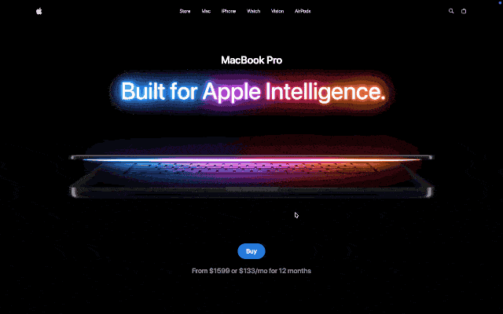

<div align="center">

# 🖥️ Mac Clone

**A pixel-perfect, animation-driven recreation of Apple's MacBook Pro landing page**

[](https://mac-clone-sigma.vercel.app/)


[Live Demo](https://mac-clone-sigma.vercel.app/) · [Report Bug](../../issues) · [Request Feature](../../issues)

</div>



---

## 📋 Table of Contents

- [Overview](#-overview)
- [Features](#-features)
- [Tech Stack](#️-tech-stack)
- [Getting Started](#-getting-started)
- [Project Structure](#-project-structure)
- [Roadmap](#-roadmap)
- [License](#-license)
- [Contact](#-contact)

---

## ✨ Overview

**Mac Clone** is a scroll-driven, cinematic landing page recreating Apple's signature MacBook product marketing site. The project focuses on translating Apple's high-end motion design language into code — smooth scroll-triggered animations, pinned sections, and staggered reveals — using GSAP's animation and scroll-linking capabilities on top of a modern React + Vite frontend.

The goal was to reverse-engineer the *feel* of Apple.com: the way sections pin and unpin as you scroll, how text and 3D-style visuals stagger in, and how the whole experience reads as a single continuous story rather than a stack of static sections.

**[🔗 View Live Site](https://mac-clone-sigma.vercel.app/)**

---

## 🔋 Features

- 🎬 **Scroll-triggered animations** — sections animate in and out precisely as they enter the viewport, powered by GSAP's ScrollTrigger
- 📌 **Pinned sections** — key sections lock in place while their internal content animates, mimicking Apple's signature scroll-storytelling effect
- 🎯 **Staggered reveals** — text, images, and UI elements animate in sequence rather than all at once, for a polished, deliberate feel
- 📱 **Responsive layout** — adapts across desktop, tablet, and mobile viewports
- ⚡ **Fast dev/build pipeline** — powered by Vite for near-instant HMR and optimized production builds
- 🧹 **Linted codebase** — ESLint configured for consistent code quality

---

## ⚙️ Tech Stack

| Category | Technology |
|---|---|
| **Frontend Library** | [React](https://react.dev/) |
| **Build Tool** | [Vite](https://vitejs.dev/) |
| **Animation** | [GSAP](https://gsap.com/) (ScrollTrigger) |
| **Linting** | ESLint |
| **Deployment** | [Vercel](https://vercel.com/) |

---

## 🤸 Getting Started

### Prerequisites

Make sure you have the following installed:

- [Git](https://git-scm.com/)
- [Node.js](https://nodejs.org/) (v18+ recommended)
- npm (comes with Node.js)

### Installation

Clone the repository:

```bash
git clone https://github.com/akachi11/mac-clone.git
cd mac-clone
```

Install dependencies:

```bash
npm install
```

Run the development server:

```bash
npm run dev
```

Open [http://localhost:5173](http://localhost:5173) in your browser to view the project.

### Build for Production

```bash
npm run build
```

---

## 📁 Project Structure

```
mac-clone/
├── public/          # Static assets (images, icons, fonts)
├── src/             # Application source code
│   ├── components/  # Reusable UI components
│   ├── assets/      # Local media used within components
│   └── App.jsx      # Root application component
├── index.html       # HTML entry point
├── vite.config.js   # Vite configuration
└── eslint.config.js # ESLint configuration
```

---

## 🗺️ Roadmap

- [ ] Add unit/integration tests
- [ ] Improve accessibility (reduced-motion support for animations)
- [ ] Add CI pipeline (lint + build checks on PR)
- [ ] Optimize asset loading and Lighthouse performance score

---

## 📄 License

Distributed under the MIT License. See `LICENSE` for more information.

---

## 📬 Contact

**Adika** — [GitHub](https://github.com/akachi11)

Project Link: [https://github.com/akachi11/mac-clone](https://github.com/akachi11/mac-clone)
